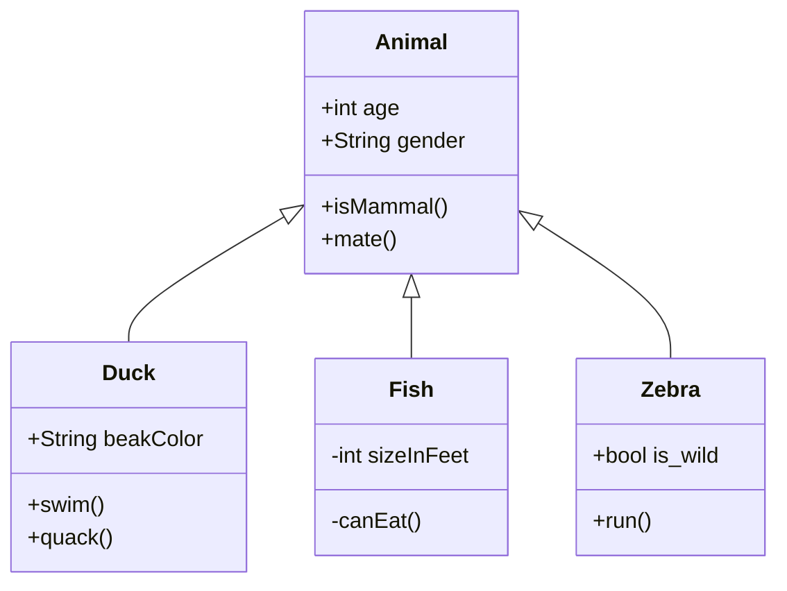
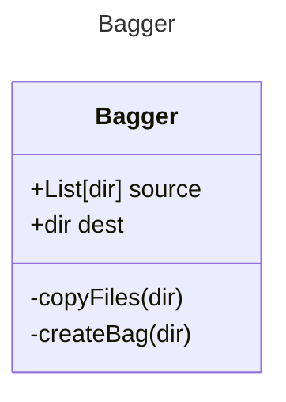

# Class Diagrams

Creating [class diagrams](https://mermaid.js.org/syntax/classDiagram.html)

- Accession
- Bagger
- ScanAV
- Metadata
  - Jove (and modules)
  - DROID




## Accession

```mermaid
classDiagram
    Accession : +String acc_id;
    Accession : +Bagger bag;
    Accession : +queryAPI(userName);
    Accession : +createBag(bag);
```

## Bagger


