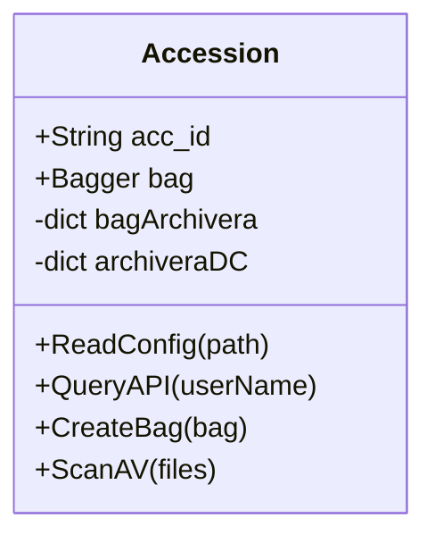
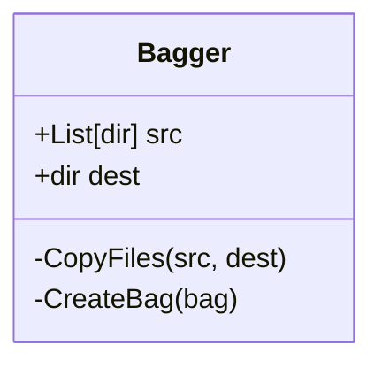
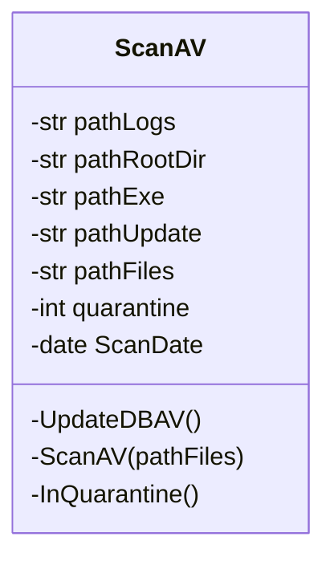
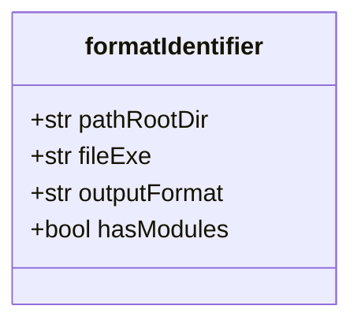
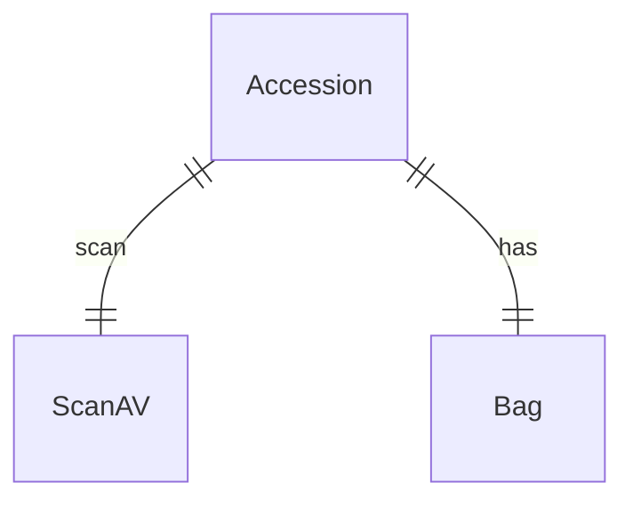

# Diagrams

Diagrams to help understand the project

## Class Diagrams

Creating [class diagrams](https://mermaid.js.org/syntax/classDiagram.html)

- Accession
- Bagger
- ScanAV
- Metadata
  - Jove (and modules)
  - DROID

### Accession

### Bagger

### ScanAV

### Format Identifiers

There are two format identifiers in use: [JHOVE](http://jhove.openpreservation.org/) and [DROID](https://www.nationalarchives.gov.uk/information-management/manage-information/preserving-digital-records/droid/). We start with a base class for the format identifiers, then we expand the base class for each identifier.

---

## Entity Relationship

The big picture

