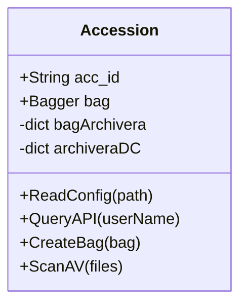
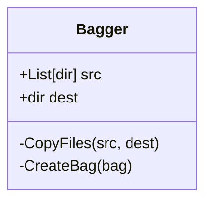
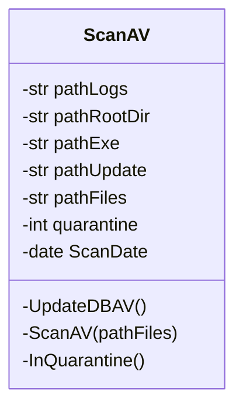
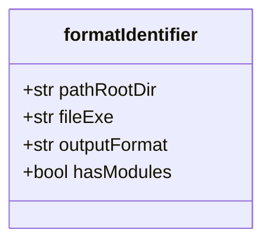
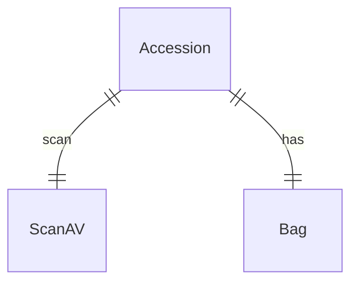

# Diagrams

Diagrams to help understand the project

## User Story

1. Scan source files.
   1. Update anti-virus database.
   1. Run AV scanner.
   1. Write log file.
1. Wait for quarantine period.
1. Scan files again.
1. If there are no infected files.
1. Copy files to destination folder.
1. Create _bag_ with Bagger.
1. Run metadata identifiers:
   1. DROID
   1. JHOVE (depending on the modules enabled.)

## Class Diagrams

- A _composition_ is an existential relationship: we can't have `TrainingData` without the two `List[Sample]` objects. And, conversely, a `List[Sample]` objject isn't used in our application without being part of a `TrainingData` object. In UML, this is a filled diamond.

- An _aggregation_, on the other hand, is a relationship where items can exist independently of eatch other. In UML this is an open diamond.

Creating [class diagrams](https://mermaid.js.org/syntax/classDiagram.html)

- Accession
- Bagger
- ScanAV
- Metadata
  - Jove (and modules)
  - DROID

### Accession

### Bagger

### ScanAV

### Format Identifiers

There are two format identifiers in use: [JHOVE](http://jhove.openpreservation.org/) and [DROID](https://www.nationalarchives.gov.uk/information-management/manage-information/preserving-digital-records/droid/). We start with a base class for the format identifiers, then we expand the base class for each identifier.

---

## Entity Relationship

The big picture

