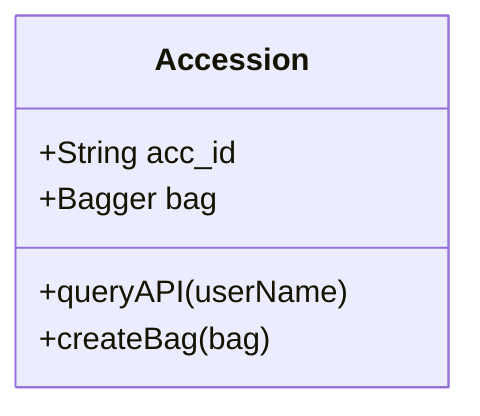
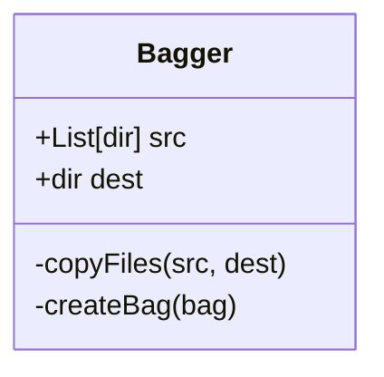

# Class Diagrams

Creating [class diagrams](https://mermaid.js.org/syntax/classDiagram.html)

- Accession
- Bagger
- ScanAV
- Metadata
  - Jove (and modules)
  - DROID

## Accession

```mermaid
classDiagram
    class Accession
    Accession : +String acc_id
    Accession : +Bagger bag
    Accession : +queryAPI(userName)
    Accession : +createBag(bag)
    
```

## Bagger

```mermaid
classDiagram
  class Bagger
  Bagger: +List[dir] src
  Bagger: +dir dest
  Bagger: -copyFiles(src, dest)
  Bagger: -createBag(bag)
```
